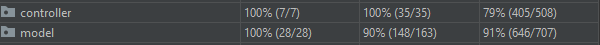

# Progetto Finale di Ingegneria del Software
## A.A. 2020-21 Evaluated 30/30 by Politecnico di Milano

### Group GC03
* Matteo Regge ([root-kawaii](https://github.com/root-kawaii))
* Nicolas Rossi ([Red-debu](https://github.com/Red-debu))
* ([AeroLALO]

### Features
* Complete Ruleset
* Socket
* CLI
* GUI
* Multiple Concurrent Matches
* Local Single Player Matches
* Resiliency to Disconnections

### Running
```
java -jar GC03.jar
```
Tested on Linux, Windows, MacOS.
#### Requirements
Java Version 15 or newer.

### Test Coverage
Element | Class % | Method % | Line %
------- | ------- | -------- | ------
Controller | 100% (7/7) | 100% (35/35) | 79% (406/508)
Model | 100% (28/28) | 90% (148/163) | 91% (646/707)


